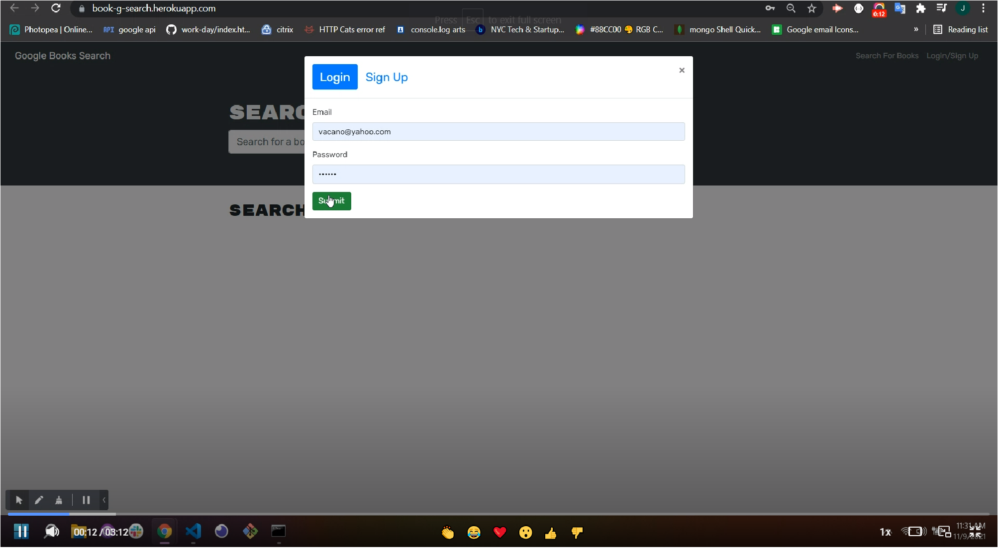
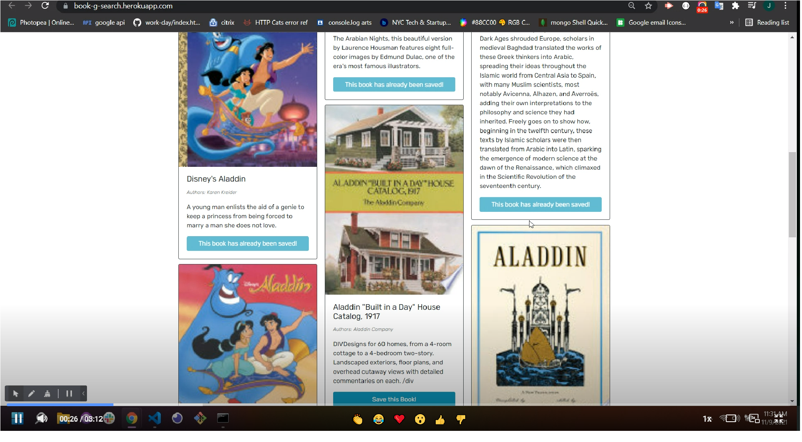
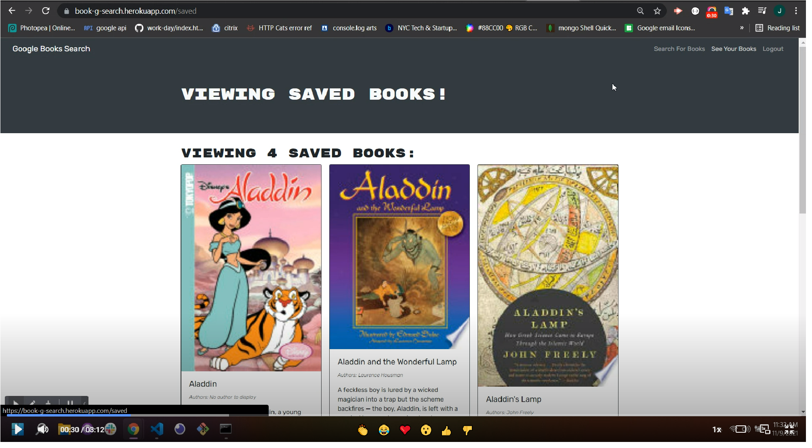
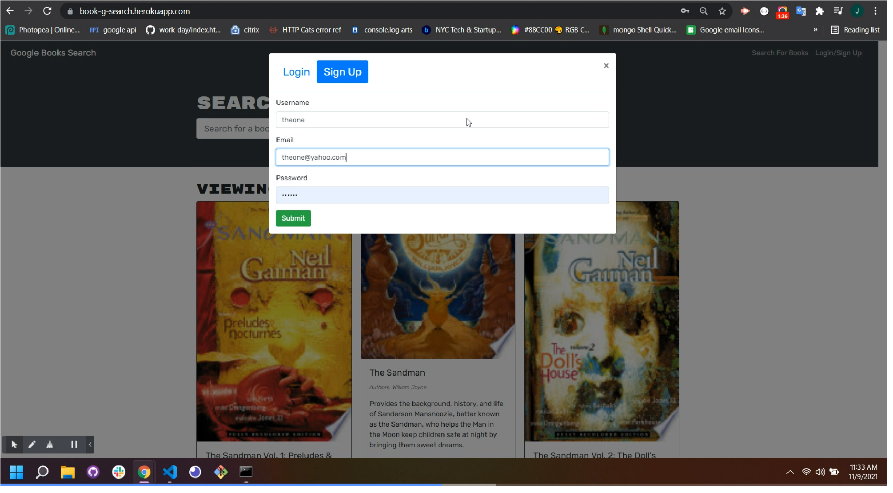

   
  
  

  

   
  <h1> Book-g-Search</h1>
   
  

    
    
    
    
        

   
   
   
  
  <a href="#about"><strong>Explore the screenshots »</strong></a>
   
   
  
  

  
  
  
  

   

  
    
    
  

  
   
  
  

  
Table of Contents

  
  - [About](#about)
  - [Built With](#built-with)
  - [Installation](#installation)
  - [Authors & contributors](#authors--contributors)
  - [Acknowledgements](#Acknowledgements)
  - [License](#License) 
  
  
  
  
   
  
  
  
  ## About     
  ---

   

 
  Small Resume app using react and other libraries like Material UI and BootStrap  
    

   
   

  

  
Usage Screenshots and Demo

    
  
   
   
   
  
   
   
  
    
   
  
   
   
  

   
   

    

  
   

please to watch the A walkthrough video demonstrating the functionality of the application click the above play Icon.

  

  
   
   
  

<table align="center"></table>
<tr><td valign="top" width="35%"> </td>

<td valign="top" width="33%"></td>
<td valign="top" width="33%">
</td></tr></table>

  ## Built With

  ---
  

  | front end  | backend | others |
| ------------- | ------------- | ------------- |
|    |    |  |
|   |  |  |
|    |    |   |
|   |  |   |
|   |    |
|  |    |
|   |   |

   

   
   
  
  ##  Installation
  ---

   
  
   1. Clone this https://github.com/mejialaguna/Book_Search
.git .
   2. Install node js <a href="https://nodejs.org/en/"> [ HERE ]</a>. 
   3. inside your terminal.   
   4. Install all Dependency using ----> npm i.  
   5. Start your server using node server inside your terminal. 
   6. Or simply jus go directly to the web site just by clicking <a href="https://book-g-search.herokuapp.com/">here.</a>
   7. Enjoy

   
   
  
  
  ##  Authors & contributors
  ---

   
   
  Jose Luis Mejia Laguna.
  
   
   
  

  ##  Acknowledgements
  ---

   

  First off , thanks for taking the time to check out my app! , contribution are what make this open-source community such an amazing place to learn , inspire and create. Any contribution you make will benefit everyone interested in using the app and are very appriciated.

   
   
  
  ## License
  ---
   

  
  
  
  

# Acceptance Criteria
GIVEN a book search engine  
WHEN I load the search engine 
THEN I am presented with a menu with the options Search for Books and Login/Signup and an input field to search for books and a submit button. 
WHEN I click on the Search for Books menu option 
THEN I am presented with an input field to search for books and a submit button. 
WHEN I am not logged in and enter a search term in the input field and click the submit button. 
THEN I am presented with several search results, each featuring a book’s title, author, description, image, and a link to that book on the Google Books site. 
WHEN I click on the Login/Signup menu option 
THEN a modal appears on the screen with a toggle between the option to log in or sign up 
WHEN the toggle is set to Signup 
THEN I am presented with three inputs for a username, an email address, and a password, and a signup button 
WHEN the toggle is set to Login 
THEN I am presented with two inputs for an email address and a password and login button 
WHEN I enter a valid email address and create a password and click on the signup button 
THEN my user account is created and I am logged in to the site 
WHEN I enter my account’s email address and password and click on the login button 
THEN I the modal closes and I am logged in to the site 
WHEN I am logged in to the site 
THEN the menu options change to Search for Books, an option to see my saved books, and Logout 
WHEN I am logged in and enter a search term in the input field and click the submit button 
THEN I am presented with several search results, each featuring a book’s title, author, description, image, and a link to that book on the Google Books site and a button to save a book to my account 
WHEN I click on the Save button on a book 
THEN that book’s information is saved to my account 
WHEN I click on the option to see my saved books 
THEN I am presented with all of the books I have saved to my   account, each featuring the book’s title, author, description, image, and a link to that book on the Google Books site and a button to remove a book from my account 
WHEN I click on the Remove button on a book 
THEN that book is deleted from my saved books list 
WHEN I click on the Logout button 
THEN I am logged out of the site and presented with a menu with the options Search for Books and Login/Signup and an input field to search for books and a submit button .